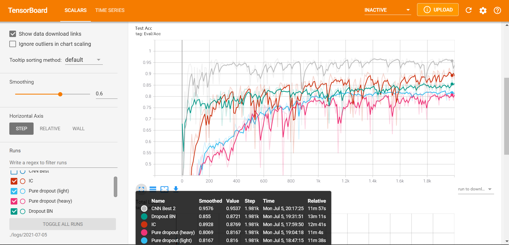
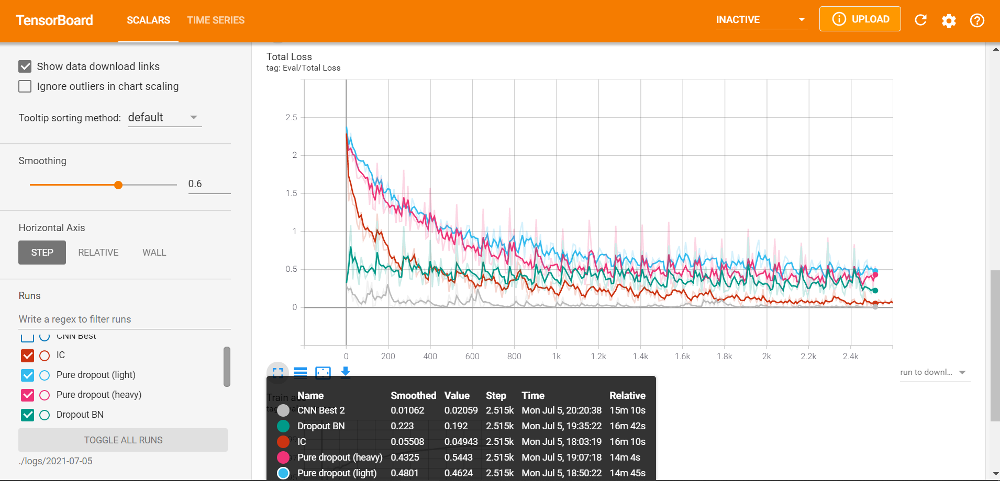

# Flaw Detection
---
#### SIGS torch classifiers for transfer learning

​		This project is built by:

- Qianyue He from Xi'an Jiaotong University. 
- Ruikang Liu from Dalian University of Technology.
- Yangen Zhan from Tianjin University.
- Jindou Xie from National University of Defense Technology.

---

### 1. Usage

​		run `python .\main.py --help` to run with parameters.

```shell
PS D:\Classifier\py> python .\main.py --help
usage: main.py [-h] [--lr LR] [--ratio RATIO] [--epochs EPOCHS]
               [--class_num CLASS_NUM] [--batch_sz BATCH_SZ]
               [--inspect INSPECT] [-d] [-t] [-l] [-c]

optional arguments:
  -h, --help            show this help message and exit
  --lr LR               Learning rate
  --ratio RATIO         Ratio for validation set
  --epochs EPOCHS       Training lasts for . epochs
  --class_num CLASS_NUM
                        How many classes we have
  --batch_sz BATCH_SZ   Batch size for miniBatch
  --inspect INSPECT     Print loss information every <inspect> batches
  -d, --del_dir         Delete dir ./logs and start new tensorboard records
  -t, --transfer        Using transfer learning
  -l, --load            Use saved model to train
  -c, --net             Use CNN? If false, use ResNet
```

#### 1.1 Single model classification

​		run:

```shell
python .\main.py -c --epochs=25 --class_num=9
```

- `-c` indicates using CNN model, otherwise, ResNet is to be used.
- `-l` parameters will load the trained model from folder `models`
- when class number is 6, a different output layer is used.

#### 1.2 Transfer Learning

​		run

```shell
python .\main.py -c -t --epochs=25 --class_num=6
```

- `-t` indicates transfer learning

---

### 2. Directory structure

- `models`: where trained `.pth` files are stored
- `auc`: to which AUC plots are outputted
- `train6`-`cr`-`cr`...: 6-class classification training / validation / test set
- `train9`-`cr`-`cr`...: 9-class classification training set
- `val9`-`cr`-`cr`...: 9-class classification test set
- `py`: where scripts are stored.
  - `auc_calc.py`: AUC plotter
  - `CNN.py`: CNN model
  - `confusion.py`: Confusion matrix plotter
  - **<u>`main.py`: Executable file for training</u>**
  - `ResNet.py`: ResNet model
  - `utils.py`: Utility functions like image loader
  - `GoogLeNet.py` LeNet implementation
  - `ResCNN.py` ResNet + CNN structure
  - `svm_gbdt.py` SVM + Gradient Boosting Tree implementation.
- `matlab`: matlab .m files for data transformation implementation.
  - `dataset1_process.m` / `dataset2_process.m`: Data pre-process.

---

### 3. Requirements

​		CUDA is compulsory. Our implementation is based on Pytorch, with:

- CNN / ResNet implementations. For not getting bothered by requirement issues, you can run:

```shell
python3 -m pip install -r requirements.py
```

---

### 4. Results

​		Tensorboard visualization for flaw classification:





- Result for 9-class classification: Acc is around 96.02% (augmented) (on test set), 95.52 (not augmented), 98.13% on train set.
- For 6-class problem: Acc is around 95.3%. Transfer learning observes a higher convergence speed than start training from the scratch.
- CNN outperforms ResNet and etc, for the reason that CNN is simpler which suits the depth of this task. ResNet and so on are more complex and difficult to train. 
- Neural Networks outperforms traditional algorithms like SVM and Gradient Boosting Tree, of which accuracies are 63.8% and 56.7% respectively.

​		
